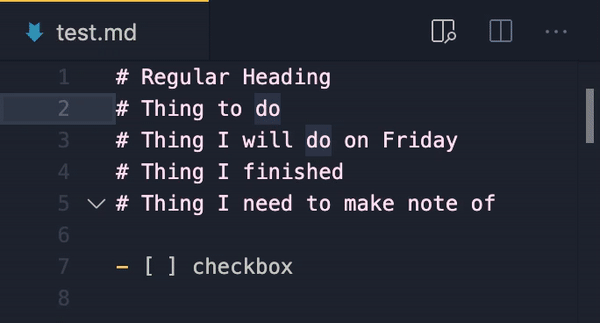

# [Markdown Org Mode](https://github.com/jessejenks/markdown-org-mode)

`markdown-org-mode` is an extension for Visual Studio Code directly inspired by
the wonderful [`org-mode`](https://marketplace.visualstudio.com/items?itemName=vscode-org-mode.org-mode)
extension.

## Customization
### TODO keywords
This extension comes with two keywords by default, `TODO` and `DONE`. However,
in your user settings you will see that you actually have `TODO.high` and
`DONE`. This means that `TODO` has high priority, while `DONE` has normal
priority. You can specify your own todo items with their own priority by
following this format:

A capital letter followed by 0 or more capital letters and underscores. This can
optionally be followed by a colon. Finally, the priority can be set by ending
the keyword with a period followed by "high", "medium", or "low".

More specifically, keywords are matched against the following regular
expression:
```
/^[A-Z][A-Z_]*:?(\.(high|medium|low))?$/
```

Not including "high", "medium", or "low" after your keyword means it just has
"normal" priority.

Some examples
- `NOTE:`
- `NOT_VERY_IMPORTANT.low`

In this case `NOTE:` will have normal priority while `NOT_VERY_IMPORTANT` will
have low priority.

Todo keywords can be inserted with the `incrementContext` and `decrementContext`
commands outlined below. These keywords will also be highlighted in your
document.

### Colors
The assigned priorities of keywords will influence how they are colored in your
document.
To customize coloring by priority, you will need to open your `settings.json`
and add some "color customizations" which might look something like this:
```json
"workbench.colorCustomizations": {
    "markdownOrgMode.highPriorityColor": "#ff0000",
    "markdownOrgMode.mediumPriorityColor": "#00ff00",
    "markdownOrgMode.normalPriorityColor": "000000",
    "markdownOrgMode.lowPriorityColor": "#0000ff",
}
```

### Checkbox symbol
You can also customize what symbol appears when you check checkboxes with the
`incrementContext` command.

The default symbol is just an "x". However any single non-whitespace character
can be used.

```
- [ ] unchecked
- [x] checked
```

Note that if you change your symbol, the `decrementContext` command will not
work on checked checkboxes which still use the old symbol.

## Commands

> An example with more keywords and a custom checkbox symbol.

For more detailed examples of the behavior of each command, please see the test
files. For a list of all commands please see the `package.json` file under
`"commands"`.

### Adding TODO items
Once you've inserted a heading, you can turn it into a todo item with the
**increment context** command.

Running this command on this line
```markdown
# Important Thing I must do
```
will result in
```markdown
# TODO Important Thing I must do
```
Running it again will produce
```markdown
# DONE Important Thing I must do
```
And running it one last time will bring you back to the original line. Similarly
the **decrement context** command will cycle through your todo keywords in the
reverse order.

### Checking off checkboxes
The **increment context** and **decrement context** commands will behave
differently on lines with checkboxes.

### Inserting headings and subheadings
These commands let you easily insert your next section heading.
Running this command on this line
```markdown
- [ ] Thing I need to complete
```
will result in
```markdown
- [x] Thing I need to complete
```

Inserting a heading with the cursor on the first or second line of this file
```markdown
# Section 3
paragraph
## Section 3.1
paragraph
### Section 3.1.4
paragraph
## Section 3.2
paragraph
```
will result in
```markdown
# Section 3
paragraph
## Section 3.1
paragraph
### Section 3.1.4
paragraph
## Section 3.2
paragraph
# 
```
moving your cursor onto the last line. But inserting a heading when your cursor
is on lines 3 or 4 will result in
```markdown
# Section 3
paragraph
## Section 3.1
paragraph
### Section 3.1.4
paragraph
## 
## Section 3.2
paragraph
```

### Promoting and Demoting heading trees
If you want a section and its subsections to have its 

Demoting when the cursor is on the first line
```markdown
# Section 3
## Section 3.1
### Section 3.1.4
```
will result in
```markdown
## Section 3
### Section 3.1
#### Section 3.1.4
```
Promoting will reverse this effect.

## Motivation
I really love how easy `org-mode` is to use and soon after discovering it I was
exclusively writing all of my notes and todo lists using this extension. But for
a lot of my purposes, I missed being able to use the many tools that already
work with markdown. I even worked on a "markdown mode" fork of the original
extension, but this felt antithetical to their project. So instead, I decided to
make a hybrid extension which used markdown syntax but incorporated a lot of
their awesome features.

If you are looking for a more established extension or are a die-hard emacs fan,
I would recommend using the original `org-mode` extension instead.
- [Github](https://github.com/vscode-org-mode/vscode-org-mode)
- [Visual Studio Marketplace](https://marketplace.visualstudio.com/items?itemName=vscode-org-mode.org-mode)


## Note
I intentionally did not include and keybindings for any commands. So you will
have to set these up yourself. This can be done by going to `Preferences >
Keyboard Shortcuts`, searching for the commands you want, and setting your
preferred shortcuts. I chose to do this because I think most people will have
their own preferences about what feels more natural for each command and will
change whatever shortcuts I chose anyway, so why bother pushing my preferences
onto them out of the box?